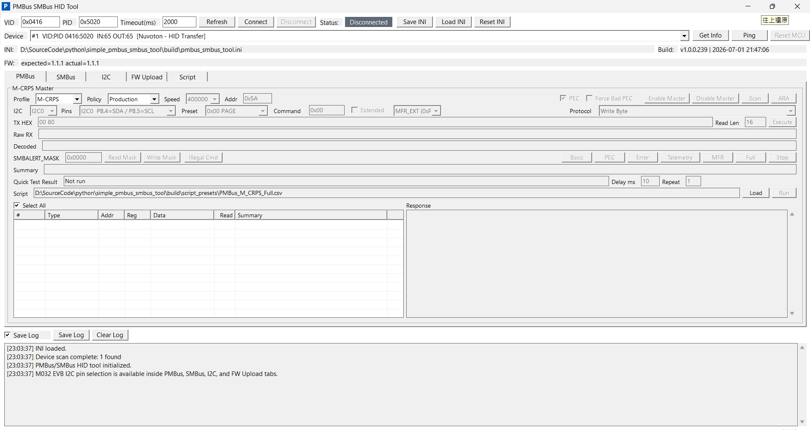
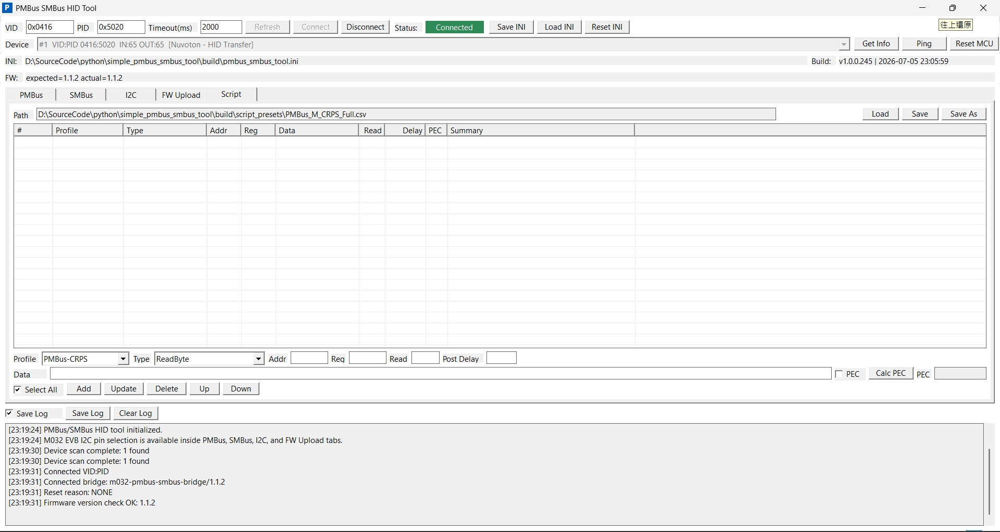
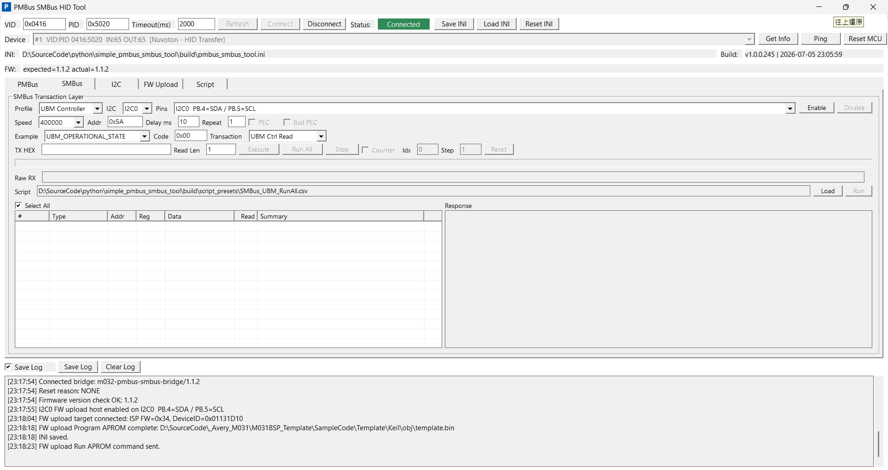
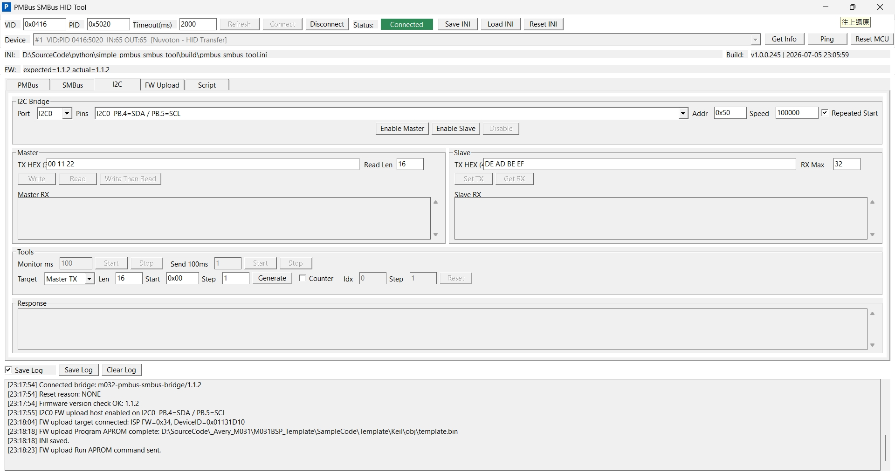

# PmbusSmbusHidTool

Windows MFC GUI tool for testing PMBus and SMBus device projects through a Nuvoton M032 EVB USB HID bridge.

The firmware turns the M032 EVB into a USB HID device. The PC GUI connects to that HID device and uses the EVB I2C controller as a PMBus/SMBus host master or a generic I2C master/slave bridge. The current user-facing scope is the `PMBus`, `SMBus`, `I2C`, and `Script` tabs plus HID connection controls.

Firmware upload has been split out to the sibling `simple_programming_tool` workspace so the programming procedure and programming bridge firmware do not affect this PMBus/SMBus validation tool.

After the split, this workspace is back to the same functional scope it had before FW upload was added: PMBus validation, SMBus validation, generic I2C transactions, CSV script editing/running, and the M032 PMBus/SMBus HID bridge firmware.

## UI Screenshots

Per-tab screenshots are embedded in the `PMBus`, `SMBus`, `I2C`, and `Script` sections below.

## Display Scaling

This tool is designed and validated with Windows display scaling set to `125%` by default:

- Windows Settings path: `System > Display > Scale & layout`
- Traditional Chinese UI path: `系統 > 顯示器 > 縮放與配置`
- Default / recommended scale for this workspace: `125%`

The current GUI layout includes DPI-aware sizing for 100%, 125%, and 150% scale settings. PMBus and SMBus tabs also provide vertical scrolling when the scaled content is taller than the available tab area, so script command lists and response panes remain reachable at 150%.

Implementation notes for keeping other simple-series MFC tools aligned with this behavior are documented in `docs\MFC_DPI_SCALING_GUIDE.md`.

## Current Scope

- Bridge board: M032 EVB
- Future bridge board: M487 EVB, not implemented yet
- Bus role: PMBus/SMBus master; generic I2C master/slave in the `I2C` tab
- Active bus: one selected I2C port/pin pair at a time
- PC transport: Windows HID class driver, 64-byte reports
- GUI target: testing external PMBus/SMBus device firmware/hardware and generic I2C transactions
- Not in scope: PMBus/SMBus slave emulation, AVSBus, fixed ALERT#/CONTROL GPIO wiring
- Not in scope: target firmware upload/ISP programming; use `simple_programming_tool` for that workflow

## Split Status

FW upload was intentionally removed from this workspace. The PMBus/SMBus bridge firmware no longer contains the programming-specific final-byte NACK exception that was needed by the Nuvoton I2C ISP flow. That programming behavior now belongs to the standalone `simple_programming_tool` project and its own M032 programming bridge firmware.

Current PMBus/SMBus tool inventory:

- PC app: `PmbusSmbusHidTool.sln`, `PmbusSmbusHidTool.vcxproj`, and `src\`
- GUI tabs: `PMBus`, `SMBus`, `I2C`, and `Script`
- M032 bridge firmware: `demo_code\M031BSP_USB_HID_PMBus_SMBus`
- PMBus contract docs: `docs\PMBUS_COMMAND_CONTRACT.csv`, `docs\PMBUS_COMMAND_CONTRACT.md`, and `docs\PMBUS_SUPPORT_MATRIX.md`
- Generated validation scripts: `build\script_presets\*.csv`
- TI historical reference files: `build\script_presets\ti_reference\`

Removed from this workspace:

- FW Upload GUI tab
- Nuvoton I2C ISP PC helper
- M031 target ISP I2C sample projects
- programming-specific M032 bridge firmware behavior

## Quick Start

1. Build and flash the M032 EVB firmware.
2. Connect the M032 EVB USB port to the PC.
3. Wire one supported M032 I2C pin pair to the target PMBus/SMBus device.
4. Build or launch the PC tool at `build\PmbusSmbusHidTool.exe`.
5. In the GUI, scan/connect VID `0x0416`, PID `0x5020`.
6. Click `Get Info`; the firmware should report `m032-pmbus-smbus-bridge/1.1.3`.
7. Open the `PMBus`, `SMBus`, or `I2C` tab.
8. Select the I2C port, pin pair, and bus speed.
9. Click the tab's master enable button.
10. Run individual transactions, scan/checklist flows, SMBus example flows, loaded CSV scripts, or generic I2C transactions against the target device.

Only one I2C owner should be enabled at the same time. Disable the active PMBus, SMBus, or I2C context before enabling another one.

## Hardware Wiring

The M032 EVB is the bridge board. The target PMBus/SMBus/I2C device is external.

Required connections:

- M032 selected `SCL` to target `SCL`
- M032 selected `SDA` to target `SDA`
- M032 `GND` to target `GND`
- I2C pull-ups compatible with the selected bus voltage

Check the target and EVB voltage domains before wiring. The firmware only controls the selected M032 I2C peripheral and pin mux; it does not add external level shifting or target power sequencing.

## Build PC Tool

Supported PC platform:

- Windows 10/11 x64
- Visual Studio C++ toolchain with MFC support
- Native MFC executable

Build command:

```bat
powershell -NoProfile -ExecutionPolicy Bypass -File scripts\build_mfc.ps1 -Configuration Release -Platform x64
```

Output:

- `build\PmbusSmbusHidTool.exe`
- `build\obj\x64\Release\PmbusSmbusHidTool.pdb`

The build script also regenerates `src\core\pmbus_contract.generated.inc` from `docs\PMBUS_COMMAND_CONTRACT.csv` and bumps the PC build version.

Clean command:

```bat
scripts\clean_mfc.bat
```

The clean script removes PC build intermediates and debug artifacts only:

- `build\obj\`
- `build\PmbusSmbusHidTool.lib`
- `build\PmbusSmbusHidTool.exp`
- `build\*.pdb`, `build\*.ilk`, `build\*.idb`, `build\*.iobj`, `build\*.ipdb`

It intentionally preserves:

- `build\PmbusSmbusHidTool.exe`
- `build\script_presets\`
- `build\test_log\`
- `build\pmbus_smbus_tool.ini`

## Build And Flash Firmware

The M032 EVB must be flashed with the HID bridge firmware from this workspace before it can act as the PMBus/SMBus/I2C bridge board. The PC GUI alone is not enough; without this firmware, the GUI will not see the expected HID bridge protocol.

Keil project:

- `demo_code\M031BSP_USB_HID_PMBus_SMBus\SampleCode\Template\Keil\Template.uvprojx`

Typical flow:

1. Open `Template.uvprojx` in Keil uVision.
2. Build the firmware target.
3. Flash the M032 EVB.
4. Reset or power-cycle the EVB.
5. Confirm Windows enumerates the HID device.
6. Use the PC GUI `Scan`, `Connect`, `Ping`, and `Get Info` controls.

Default USB identity:

- VID `0x0416`
- PID `0x5020`

Firmware version string:

- `m032-pmbus-smbus-bridge/1.1.3`

Important firmware files:

- `hid_tool_api.c` - HID command dispatcher
- `m031_bridge_i2c.c` - M032/M031 I2C master/slave bridge implementation
- `m031_bridge_i2c.h` - I2C bridge API and error status
- `bridge_protocol.h` - HID command IDs and status codes
- `bridge_version.h` - firmware version string
- `hid_transfer.h` - USB VID/PID and HID settings

## HID Bridge Protocol

The bridge uses 64-byte HID reports with a fixed 6-byte header:

- Byte 0: magic `0xA5`
- Byte 1: command
- Byte 2: sequence
- Byte 3: status
- Byte 4-5: payload length, little-endian
- Byte 6-63: payload

The firmware currently supports:

- Ping
- Get Info
- Reset MCU
- I2C master init/deinit
- I2C master write
- I2C master read
- I2C master write-read with repeated-start support
- I2C slave init/deinit
- I2C slave TX preload
- I2C slave RX fetch
- staged write/read helpers for payloads larger than one HID report
- PMBus block read
- PMBus group write
- I2C bus status and recovery
- SMBus Quick command
- timeout-aware I2C error reporting

Direct I2C write/read commands always complete with a STOP. Repeated-start is used by the write-read command path.

## I2C Selection

The GUI owns I2C selection and sends the selected tuple to firmware:

- I2C port: `I2C0` or `I2C1`
- SDA pin
- SCL pin
- bus speed

Only one I2C port/pin pair is active at a time. The firmware configures the selected M032 pin mux during master/slave init and releases the selected mux during deinit.

Supported M032 pin pairs:

- I2C0: `PB.4/PB.5`, `PF.2/PF.3`, `PA.4/PA.5`, `PC.0/PC.1`
- I2C1: `PB.2/PB.3`, `PB.0/PB.1`, `PA.6/PA.7`, `PA.2/PA.3`, `PF.1/PF.0`, `PC.4/PC.5`, `PB.10/PB.11`

SDA/SCL order is shown by the GUI pin-pair label. Confirm the EVB schematic before wiring a target board.

## GUI Features

Top-level HID controls:

- VID/PID selection
- device scan/connect/disconnect
- timeout setting
- Ping
- Get Info
- Reset MCU
- log output

Shared PMBus/SMBus tab behavior:

- user-selected I2C port and pin pair
- user-selected bus speed
- master enable/disable
- single active PMBus/SMBus master ownership guard
- CSV script `Load` and `Run`
- `Stop` for active PMBus checklist/script runs and SMBus `Run All`/script runs; cancellation takes effect after the current HID transaction returns
- editable per-command delay for PMBus checklist runs and SMBus `Run All` validation, capped at `1000` ms
- repeat count for PMBus checklist runs and SMBus `Run All` validation, capped at `20` loops
- read/write-read response panel for selected script rows
- persisted runtime state in `pmbus_smbus_tool.ini`

I2C tab behavior:

- user-selected I2C port and M032 pin pair
- user-selected 7-bit address and bus speed
- `Enable Master`, `Enable Slave`, and `Disable`
- master `Write`, `Read`, and `Write Then Read`
- repeated-start option for write-read transactions
- slave `Set TX` preload and `Get RX` fetch from the firmware RX buffer
- monitor timer for repeated master reads or slave RX polling
- interval send timer for master writes or slave TX updates
- TX data generator and optional counter byte update
- shared ownership guard with PMBus and SMBus tabs so only one I2C context is active

Script tab behavior:

- load, edit, save, and save-as M032 CSV scripts
- unsaved edits are indicated by `Unsaved changes`, `Save *`, and `Script *`
- in-tab row editing; no popup editor is used
- profile selection: `SMBus-Generic`, `SMBus-UBM`, `PMBus-Base`, `PMBus-CRPS`, `PMBus-TI-UCD90xxx`
- profile-specific command format dropdowns
- row fields for slave address, register code, data bytes, read length, delay, and PEC enable
- command row reordering with `Up` and `Down`
- `Pause` rows and command-row delay from `1` to `10000` ms
- PEC helper for quickly calculating the byte sequence seed/result before saving script rows

## PMBus Tab

The `PMBus` tab is a PMBus master test surface.



Profiles:

- `PMBus Base`
- `M-CRPS`
- `TI UCD90xxx`

Supported master transactions:

- Send Byte
- Receive Byte
- Write Byte
- Write Word
- Read Byte
- Read Word
- Read 32
- Block Write
- Block Read
- Process Call
- Block Write-Read Process Call
- staged long block transfers
- PMBus group write

Supported helpers:

- PEC enable/disable
- Force Bad PEC for negative-path target validation
- device scan
- M032 CSV script load/run with selectable rows and response display
- scan summary with PMBUS_REVISION, MFR_ID, and MFR_MODEL where available
- bus idle/recover preflight
- ARA receive-byte helper at address `0x0C`
- SMBALERT_MASK read/write helper
- extended command mode through `FEh MFR_SPECIFIC_COMMAND_EXT` and `FFh PMBUS_COMMAND_EXT`
- checklist flows: `Basic`, `PEC`, `Error`, `Telemetry`, `MFR`, and `Full`
- checklist progress/status text is shown while long `MFR` and `Full` coverage groups are running
- checklist `Delay ms` inserts a cancellable pause after each PMBus checklist transaction
- checklist `Repeat` reruns the selected checklist suite and shows loop `x/y` in status/log output

Command visibility, legal transaction masks, decode policy, and checklist coverage are driven by:

- `docs\PMBUS_COMMAND_CONTRACT.csv`
- generated include `src\core\pmbus_contract.generated.inc`

When PMBus command support changes, update the CSV first and run:

```bat
powershell -NoProfile -ExecutionPolicy Bypass -File scripts\validate_pmbus_contract.ps1
```

PMBus button validation workflow:

1. Connect the M032 EVB HID bridge and click `Get Info`; expected firmware is `m032-pmbus-smbus-bridge/1.1.3`.
2. Select `PMBus`, choose the target profile (`PMBus Base`, `M-CRPS`, or `TI UCD90xxx`), I2C port, pin pair, speed, and 7-bit target address. The validation target used by the bundled scripts uses address `0x5A`.
3. Enable the PMBus master.
4. Click `Scan` first and confirm the expected PMBus address responds.
5. Run `Basic`, `PEC`, `Error`, `Telemetry`, `MFR`, and `Full` as needed. `Full` is the broadest button test and includes the lower-coverage groups plus stress and profile-specific checks.
6. For long runs, watch the progress/status text. Use `Stop` if a timeout or target issue requires canceling; the stop takes effect after the current HID/I2C transaction returns.
7. Compare the GUI log, MCU UART/TeraTerm log, and LA decode by address, command code, write data, read length, PEC status, and target response. Timestamps do not need to match exactly.

Recommended PMBus quick validation order for a new setup:

- `Scan`
- `Basic`
- `PEC`
- `Error`
- `Telemetry`
- `MFR`
- `Full`

Use `Repeat` only after a single loop passes. Keep `Delay ms` at `10` ms for the bundled validation target unless the target needs more recovery time.

## Script Tab And CSV Runner

Script editing is centralized in the `Script` tab. The PMBus and SMBus tabs only load and run scripts.



The saved CSV format is the M032 HID tool format, not the TI USB-to-GPIO 2006 ScriptForm format. This is intentional because the M032 bridge can support repeated-start write-read flows such as write data with PEC followed by read data with PEC, which the TI ScriptForm flow cannot represent cleanly.

M032 CSV header:

```csv
Kind,Selected,Profile,Type,Address,Command,Data,ReadLength,DelayMs,PEC,Comment
```

Common rows:

- `Command,1,PMBus-CRPS,ReadByte,0x5A,0x98,,1,10,1,`
- `Command,1,SMBus-Generic,BlockWriteReadProcessCall,0x5A,0x60,01 02 03 04,8,10,1,`
- `Command,1,SMBus-UBM,BlockRead,0x5A,0x41,,35,10,0,`
- `Command,1,SMBus-Generic,BadPecWriteByte,0x5A,0x20,4A,,10,1,`
- `Command,1,SMBus-UBM,BadChecksumWrite,0x5A,0x34,00 00,,10,0,`
- `Pause,1,PMBus-CRPS,Pause,,,,,10,0,`
- `Comment,,,,,,,,,,free text`

Profiles:

- `SMBus-Generic`: normal SMBus transaction layer commands.
- `SMBus-UBM`: UBM controller read/write flows using the tool's UBM checksum path.
- `PMBus-Base`: PMBus base-profile commands using SMBus/PMBus transaction formats and optional PEC.
- `PMBus-CRPS`: PMBus/M-CRPS commands using SMBus/PMBus transaction formats and optional PEC.
- `PMBus-TI-UCD90xxx`: PMBus/TI UCD90xxx command smoke scripts using SMBus/PMBus transaction formats and optional PEC.

For write-style formats, including `SMBus-UBM` writes, enter payload bytes in the `Data` / `Data Bytes` field. Hex bytes can be separated by spaces, semicolons, colons, or `|`, for example `01 02 03 04`.

Supported command formats include:

- `QuickWrite`, `QuickRead`
- `SendByte`, `ReceiveByte`
- `WriteByte`, `WriteWord`
- `ReadByte`, `ReadWord`, `Read32`
- `BlockWrite`, `BlockRead`
- `ProcessCall`
- `BlockWriteReadProcessCall`
- `BusRecover`
- `BadPecWriteByte` for PMBus/SMBus negative-path PEC testing
- `BadChecksumWrite` for SMBus-UBM negative-path checksum testing

Script tab workflow:

1. Open the `Script` tab.
2. Click `Load`, or create rows directly.
3. Select `Profile` and command `Type`.
4. Fill slave address, register code, data, read length, delay, and PEC.
5. Click `Calc PEC` when PEC review is needed.
6. Use `Add`, `Update`, `Delete`, `Up`, and `Down` to manage row order.
7. Click `Save` or `Save As`.

PMBus/SMBus runner workflow:

1. Enable the target tab's master after selecting I2C port, pin pair, and speed.
2. Click `Load` in the `PMBus` or `SMBus` tab.
3. Use `Select All` or individual row checkboxes to choose which rows will run.
4. Click `Run`.
5. Track the progress bar and done/remaining counters while the selected executable rows run.
6. Read or write-read rows append raw/data response text to the right-side response panel.

The runner uses the active tab's I2C port/pin/speed selection. It skips comments, counts only selected `Command` and `Pause` rows in the progress total, delays on `Pause` rows, applies command-row `DelayMs` after a command, and executes selected command rows through the M032 HID I2C master bridge. Script tab delay editing accepts `1` to `10000` ms. Use `Stop` to cancel the remaining selected rows after the in-flight HID transaction completes.

TI reference material:

- Example source CSV: `build\script_presets\ti_reference\SMBusI2CScriptForm.csv`
- Validated sequence notes: `build\script_presets\ti_reference\TI_USB_TO_GPIO_2006_PMBUS_SMBUS_SCRIPT_SEQUENCE.md`

These two files are reference material only. The GUI does not use them as default runtime scripts. Use the TI sequence document to understand the original test coverage, row counts, and known TI ScriptForm limitations. Use `SMBusI2CScriptForm.csv` only when comparing against the historical TI USB-to-GPIO ScriptForm flow. New saved scripts and normal validation runs should use the M032 CSV format above and the generated presets below.

Generated M032 validation preset scripts:

- `build\script_presets\PMBus_Base_Full.csv`
- `build\script_presets\PMBus_M_CRPS_Full.csv`
- `build\script_presets\PMBus_TI_UCD90xxx_Full.csv`
- `build\script_presets\SMBus_Generic_RunAll.csv`
- `build\script_presets\SMBus_UBM_RunAll.csv`

Temporary or experimental scripts can be placed under `build\script_presets\_staging`. That folder is intended for local scratch CSVs; only its README is kept for repository structure.

Regenerate these files with:

```bat
powershell -NoProfile -ExecutionPolicy Bypass -File scripts\generate_validation_script_csvs.ps1
```

The PMBus preset scripts cover Full-button bus transactions. The PMBus Full button remains the authority for GUI-side assertions, dynamic read/restore checks, group write, ARA, and manual lab-only items.

Preset script validation workflow:

1. Open the target tab (`PMBus` or `SMBus`), select the same I2C port/pins/speed used for the button test, and enable master mode.
2. Click `Load` in the target tab and select the matching preset CSV:
   - PMBus Base: `build\script_presets\PMBus_Base_Full.csv`
   - PMBus M-CRPS: `build\script_presets\PMBus_M_CRPS_Full.csv`
   - PMBus TI UCD90xxx: `build\script_presets\PMBus_TI_UCD90xxx_Full.csv`
   - SMBus Generic: `build\script_presets\SMBus_Generic_RunAll.csv`
   - SMBus UBM Controller: `build\script_presets\SMBus_UBM_RunAll.csv`
3. Click `Select All`, or select only the rows needed for a focused retest.
4. Click `Run` and watch the progress bar, done/remaining counters, and response pane.
5. Use `Stop` to cancel the remaining selected rows after the in-flight transaction completes.
6. Compare the script GUI log against the matching button-test log. Script runs should match the same bus transaction intent; button tests may include extra GUI-side assertions and manual-only checks.

Validation logs captured during local bring-up are kept under `build\test_log` in this workspace. These logs are published with the repository as validation evidence for the known-good PMBus/SMBus button and script runs.

## SMBus Tab

The `SMBus` tab is an SMBus master test surface.



Profiles:

- `Generic`
- `UBM Controller`

Supported master workflows:

- Quick Write
- Quick Read
- Send Byte
- Receive Byte
- Write Byte
- Read Byte
- Write Word
- Read Word
- Process Call
- Block Write
- Block Read
- Block Write-Read Process Call
- optional PEC handling
- Force Bad PEC for negative-path target validation where applicable
- UBM bad-checksum write for negative-path controller validation
- M032 CSV script load/run with selectable rows and response display
- profile-specific `Run All` example validation
- `Run All` `Delay ms` inserts a cancellable pause after each SMBus validation transaction
- `Run All` `Repeat` reruns Generic or UBM validation and reports `loops=N` in the summary

The SMBus tab uses the same M032 HID bridge and the same selected I2C port/pin pair model as PMBus.

SMBus button validation workflow:

1. Connect the M032 EVB HID bridge and click `Get Info`.
2. Select `SMBus`, choose profile `Generic` or `UBM Controller`, I2C port, pin pair, speed, and target address. The bundled validation target uses address `0x5A`.
3. Enable the SMBus master.
4. For `Generic`, use `Run All` to execute Quick, Send/Receive Byte, Byte/Word read-write, Block, Process Call, Block Write-Read Process Call, Bad PEC, and Bus Recover coverage.
5. For `UBM Controller`, use `Run All` to execute controller register read/write, block read/write, shell command, descriptor, event-data, and bad-checksum coverage.
6. Use `Repeat` only after one loop passes. The summary reports `loops=N`, pass count, and fail count.
7. Use `Stop` if the target times out or the bus needs inspection; cancellation takes effect after the current HID/I2C transaction returns.
8. Compare GUI log, MCU UART/TeraTerm log, and LA decode by address, command/register code, write data, read length, PEC or UBM checksum, and target response. Timestamps do not need to match exactly.

## I2C Tab

The `I2C` tab is a generic I2C utility surface for direct master transactions and simple slave-mode bring-up. Use it when the target protocol is not PMBus or SMBus, or when a bus-level sanity check is needed before running higher-level PMBus/SMBus workflows.



Master controls:

- `Port`, `Pins`, and `Speed` select the active M032 I2C hardware path.
- `Addr` is the 7-bit target address.
- `Enable Master` initializes the selected M032 I2C peripheral as a host.
- `TX HEX` accepts space-separated hex bytes for write and write-read operations.
- `Read Len` selects the number of bytes to read.
- `Write` sends `TX HEX` followed by STOP.
- `Read` reads `Read Len` bytes from the selected address.
- `Write Then Read` writes `TX HEX`, then reads `Read Len`; enable repeated-start when the target requires a combined transaction.
- The response area shows raw received bytes and error text.

Slave controls:

- `Enable Slave` initializes the selected M032 I2C peripheral as a slave at `Addr`.
- `Set TX` preloads the bytes that an external I2C master will read from the M032 bridge.
- `Get RX` fetches bytes written by an external I2C master into the firmware RX buffer.
- Slave mode is for generic I2C validation only; PMBus/SMBus slave emulation is not part of this workspace scope.

Timers and data helpers:

- Monitor mode can repeat master reads or poll slave RX at the selected interval.
- Interval send can repeat master writes or refresh slave TX data.
- TX data generator and counter options help produce incrementing byte patterns for repeated tests.
- Use `Disable` before switching to another tab or changing to another bus owner.

Recommended I2C workflow:

1. Connect the M032 EVB HID bridge and click `Get Info`.
2. Select `I2C`, choose the I2C port, pin pair, speed, and 7-bit address.
3. Click `Enable Master` for host-side tests, or `Enable Slave` when an external master will drive the bus.
4. Start with a short `Write`, `Read`, or `Write Then Read`.
5. Confirm the LA decode shows the same address, write bytes, read length, STOP/repeated-start behavior, and ACK/NACK pattern expected by the target.
6. Click `Disable` when finished so PMBus, SMBus, or Script can own the I2C bus.

## Manual UI Equivalence Smoke Test

The button and script tests validate the shared HID/I2C transaction helpers. The manual UI smoke test below validates the extra UI layer: dropdown selection, command/register field parsing, data-byte parsing, read-length parsing, PEC/bad-PEC controls, and UBM checksum selection.

Before running manual smoke tests:

1. Connect the M032 EVB HID bridge and click `Get Info`.
2. Select the same I2C port, pin pair, speed, and target address used by the passing button/script validation. The bundled validation examples use address `0x5A`.
3. Enable the target tab master.
4. Run one row at a time and compare GUI log, MCU UART/TeraTerm log, and LA decode. Check address, command/register code, write data, read length, PEC or checksum byte, and response payload. Ignore timestamp differences.

PMBus manual smoke examples:

Use the `PMBus` tab. Select the command by preset when the preset exists; otherwise type the hex command in `Command`. Select the listed `Protocol`, fill `TX HEX` and `Read Len`, set PEC controls, then click `Execute`.

| Test | Profile | Preset or command | Protocol | TX HEX | Read Len | PEC | Bad PEC | Expected check |
| --- | --- | --- | --- | --- | --- | --- | --- | --- |
| Send Byte | PMBus Base | `0x03 CLEAR_FAULTS` | `Send Byte` | empty | `0` | off | off | LA write has command `03` and STOP. |
| Write Byte | PMBus Base | `0x00 PAGE` | `Write Byte` | `00` | `0` | off | off | LA write has `00 00`. |
| Write Word | PMBus Base | `0x1B SMBALERT_MASK` | `Write Word` | `00 00` | `0` | off | off | LA write has command plus two data bytes. |
| Read Byte | PMBus Base | `0x98 PMBUS_REVISION` | `Read Byte` | empty | `1` | off | off | LA repeated-start read length is one data byte. |
| Read Word | PMBus Base | `0x79 STATUS_WORD` | `Read Word` | empty | `2` | off | off | LA repeated-start read length is two data bytes. |
| Read 32 | PMBus Base | `0x83 READ_EIN` | `Read 32` | empty | `4` | off | off | LA repeated-start read length is four data bytes. |
| Block Write | PMBus Base | `0xB0 USER_DATA_00` | `Block Write` | `55 A5 10 20` | `0` | off | off | LA write includes byte count `04` before data. |
| Block Read | PMBus Base | `0x9A MFR_MODEL` | `Block Read` | empty | `32` | off | off | LA read starts with block count then payload. |
| Process Call | PMBus Base | `0x21 VOUT_COMMAND` | `Process Call` | `E0 2E` | `2` | off | off | LA write-word/read-word process call is visible. |
| Block Wr/Rd ProcCall | PMBus Base | `0x1A QUERY` | `Block Wr/Rd ProcCall` | `98` | `1` | off | off | LA write contains query target `98`, then read returns one byte. |
| Bad PEC | PMBus Base | `0x02 ON_OFF_CONFIG` | `Write Byte` | `1A` | `0` | on | on | Target should reject or flag bad PEC; run a positive `Read Byte 0x98` afterward to confirm bus recovery. |

SMBus Generic manual smoke examples:

Use the `SMBus` tab with profile `Generic`. Select the `Example` preset when available; it fills transaction, code, data, and read length. Otherwise select `Transaction` manually and fill `Code`, `TX HEX`, and `Read Len`.

| Test | Example or transaction | Code | TX HEX | Read Len | PEC | Bad PEC | Expected check |
| --- | --- | --- | --- | --- | --- | --- | --- |
| Quick Write | `SMB_EXAMPLE_QUICK_WRITE` | `0x00` | empty | `0` | off | off | LA shows SMBus quick write address cycle. |
| Quick Read | `SMB_EXAMPLE_QUICK_READ` | `0x00` | empty | `0` | off | off | LA shows SMBus quick read address cycle. |
| Send Byte | `SMB_EXAMPLE_SEND_BYTE_A` | `0x10` | empty | `0` | on | off | LA write has command and PEC. |
| Receive Byte setup | `SMB_EXAMPLE_RECEIVE_SELECT_A` | `0x12` | empty | `0` | on | off | Selects the target-side receive-byte source. |
| Receive Byte | `SMB_EXAMPLE_RECEIVE_BYTE` | `0x00` | empty | `1` | on | off | LA read has one data byte plus PEC. |
| Write Byte | `SMB_EXAMPLE_WRITE_BYTE_A` | `0x20` | `00` | `0` | on | off | LA write has command, one data byte, and PEC. |
| Read Byte | `SMB_EXAMPLE_READ_BYTE_A` | `0x22` | empty | `1` | on | off | LA read has one data byte plus PEC. |
| Write Word | `SMB_EXAMPLE_WRITE_WORD_A` | `0x30` | `34 00` | `0` | on | off | LA write has low byte then high byte plus PEC. |
| Read Word | `SMB_EXAMPLE_READ_WORD_A` | `0x32` | empty | `2` | on | off | LA read has two data bytes plus PEC. |
| Block Write | `SMB_EXAMPLE_BLOCK_WRITE_A` | `0x40` | `10 11 12 13 14 15 16 00` | `0` | on | off | LA write includes block count and payload plus PEC. |
| Block Read | `SMB_EXAMPLE_BLOCK_READ_A` | `0x42` | empty | `8` | on | off | LA read starts with count and payload plus PEC. |
| Process Call | `SMB_EXAMPLE_PROCESS_CALL_A` | `0x50` | `34 00` | `2` | on | off | LA write-word/read-word process call is visible. |
| Block Wr/Rd ProcCall | `SMB_EXAMPLE_BLOCK_PROC_CALL_A` | `0x60` | `01 02 03 04 05 06 07 00` | `8` | on | off | LA write block followed by read block is visible. |
| Bad PEC | `Write Byte` | `0x20` | `4A` | `0` | on | on | Target should reject or flag bad PEC; run `Send Byte 0x12` then `Receive Byte` afterward to confirm bus recovery. |
| Bus Recover | `Bus Recover` | `0x00` | empty | `0` | off | off | GUI raw response reports bus status/recovery result. |

SMBus UBM manual smoke examples:

Use the `SMBus` tab with profile `UBM Controller`. UBM checksum is handled by the selected UBM transaction path; leave PEC off.

| Test | Example or transaction | Code | TX HEX | Read Len | Expected check |
| --- | --- | --- | --- | --- | --- |
| UBM Ctrl Read | `UBM_OPERATIONAL_STATE` | `0x00` | empty | `1` | LA write sends register plus checksum, then read returns data plus checksum. |
| UBM Ctrl Write | `UBM_FEATURES_WRITE` | `0x34` | `00 00` | `0` | LA write sends register, data, and valid UBM checksum. |
| Bad Checksum Write | `UBM_BAD_CHECKSUM_WRITE` or `UBM Bad Checksum Write` | `0x34` | `00 00` | `0` | LA write checksum is intentionally wrong. Follow with `UBM_LAST_COMMAND_STATUS` (`0x01`, read length `1`) and expect LCS `0x02` on the validation target. |

## Configuration

Runtime INI:

- `pmbus_smbus_tool.ini`

The default INI is created beside `PmbusSmbusHidTool.exe`. Script preset paths under the exe directory are saved as exe-relative paths, for example `script_presets\PMBus_Base_Full.csv`, so a copied build folder can still find its bundled presets. Absolute paths are only preserved when the user selects files outside the exe directory.

Saved state includes:

- HID VID/PID
- HID timeout
- PMBus profile
- SMBus profile
- PMBus/SMBus/I2C port and pin-pair selections
- PMBus/SMBus command UI state
- I2C master/slave transaction UI state
- Script tab CSV path
- PMBus/SMBus runner CSV paths

This repository intentionally keeps `build\PmbusSmbusHidTool.exe`, `build\pmbus_smbus_tool.ini`, and `build\test_log` so a new user can launch the known-good binary and inspect the validation evidence directly after checkout.

## Project Structure

- `src\` - MFC app, HID transport, PMBus/SMBus/I2C/Script tabs, app state
- `scripts\` - MFC build, version, and validation helper scripts
- `docs\` - PMBus command contract, support matrix, DPI scaling notes, and protocol references
- `demo_code\` - M032 EVB HID bridge firmware project
- `build\` - generated PC build output
- `SELF_CHECK.md` - latest verification record
- `HANDOFF.md` - current implementation handoff notes
- `AGENTS.md` - local development rules for this workspace

Expected source-controlled content for GitHub:

- root documentation and Visual Studio project files
- `src\`
- `scripts\`
- `docs\`
- `demo_code\M031BSP_USB_HID_PMBus_SMBus`
- `build\script_presets\PMBus_Base_Full.csv`
- `build\script_presets\PMBus_M_CRPS_Full.csv`
- `build\script_presets\PMBus_TI_UCD90xxx_Full.csv`
- `build\script_presets\SMBus_Generic_RunAll.csv`
- `build\script_presets\SMBus_UBM_RunAll.csv`
- `build\script_presets\ti_reference\SMBusI2CScriptForm.csv`
- `build\script_presets\ti_reference\TI_USB_TO_GPIO_2006_PMBUS_SMBUS_SCRIPT_SEQUENCE.md`
- `build\script_presets\_staging\README.md`

## GitHub Upload Notes

Before uploading a public copy, keep source, scripts, docs, firmware project files, generated script presets, TI reference files, the built GUI executable, the default INI, and validation logs:

- `build\PmbusSmbusHidTool.exe`
- `build\pmbus_smbus_tool.ini`
- `build\test_log\`

Exclude the remaining local and generated artifacts:

- `build\obj\`
- `build\*.pdb` and other PC build intermediates
- root `teraterm.log`
- root `*.obj`, `*.pdb`, and other compiler/linker intermediates
- Keil `lst\`, `obj\`, `*.uvguix.*`, and local debug-driver INI files

The included `.gitignore` is set up for this split. It keeps source-controlled validation assets such as `build\script_presets\*.csv`, `build\script_presets\ti_reference\SMBusI2CScriptForm.csv`, `build\script_presets\ti_reference\TI_USB_TO_GPIO_2006_PMBUS_SMBUS_SCRIPT_SEQUENCE.md`, `build\PmbusSmbusHidTool.exe`, `build\pmbus_smbus_tool.ini`, and `build\test_log\` available while excluding other local runtime/build artifacts and scratch files under `build\script_presets\_staging`.

Repository check before upload:

1. Confirm the local folder is a valid Git worktree. If `git status` reports `not a git repository`, initialize or recreate the repository metadata before uploading.
2. Confirm `git status --short` includes `build\PmbusSmbusHidTool.exe`, `build\pmbus_smbus_tool.ini`, and `build\test_log\` when they are not already tracked.
3. Confirm `git status --short` does not include root `teraterm.log`, `build\obj`, root object files, Keil `obj`/`lst`, or user-specific Keil files.
4. Confirm no accidental FW upload source files are present in this workspace.
5. Confirm `Get Info` expects `m032-pmbus-smbus-bridge/1.1.3`.
6. Keep target firmware upload content in `simple_programming_tool`, not this repository.

## Verification

PC build:

```bat
powershell -NoProfile -ExecutionPolicy Bypass -File scripts\build_mfc.ps1 -Configuration Release -Platform x64
```

PMBus contract validation:

```bat
powershell -NoProfile -ExecutionPolicy Bypass -File scripts\validate_pmbus_contract.ps1
```

Firmware syntax check, when `arm-none-eabi-gcc` is available:

```bat
arm-none-eabi-gcc -mcpu=cortex-m0 -mthumb -std=gnu99 -fsyntax-only ^
  -Idemo_code\M031BSP_USB_HID_PMBus_SMBus\Library\CMSIS\Core\Include ^
  -Idemo_code\M031BSP_USB_HID_PMBus_SMBus\Library\Device\Nuvoton\M031\Include ^
  -Idemo_code\M031BSP_USB_HID_PMBus_SMBus\Library\StdDriver\inc ^
  -Idemo_code\M031BSP_USB_HID_PMBus_SMBus\SampleCode\Template ^
  demo_code\M031BSP_USB_HID_PMBus_SMBus\SampleCode\Template\m031_bridge_i2c.c

arm-none-eabi-gcc -mcpu=cortex-m0 -mthumb -std=gnu99 -fsyntax-only ^
  -Idemo_code\M031BSP_USB_HID_PMBus_SMBus\Library\CMSIS\Core\Include ^
  -Idemo_code\M031BSP_USB_HID_PMBus_SMBus\Library\Device\Nuvoton\M031\Include ^
  -Idemo_code\M031BSP_USB_HID_PMBus_SMBus\Library\StdDriver\inc ^
  -Idemo_code\M031BSP_USB_HID_PMBus_SMBus\SampleCode\Template ^
  demo_code\M031BSP_USB_HID_PMBus_SMBus\SampleCode\Template\hid_tool_api.c
```

Hardware smoke test:

1. Flash the firmware to M032 EVB.
2. Launch `build\PmbusSmbusHidTool.exe`.
3. Scan/connect VID `0x0416`, PID `0x5020`.
4. Click `Ping`.
5. Click `Get Info`; expect `m032-pmbus-smbus-bridge/1.1.3`.
6. Select a known-good I2C port/pin pair.
7. Connect a target PMBus/SMBus/I2C device.
8. Enable PMBus or SMBus master, or enable the generic I2C master/slave mode.
9. Run a simple read/write transaction.
10. For slave mode, have an external master write to the selected address and confirm `Get RX`; preload `Set TX` and confirm the external master can read it.

See `SELF_CHECK.md` for the latest verification result captured in this workspace.
